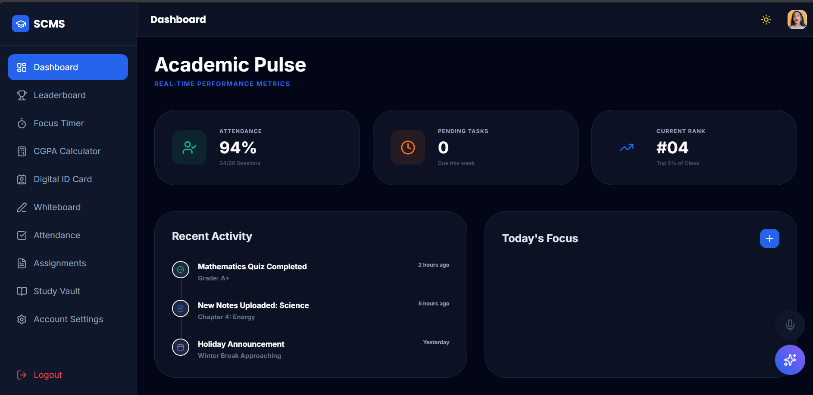

# 🎓 Smart Classroom Management System (SCMS)


> A futuristic, AI-powered Smart Classroom dashboard designed for Students, Teachers, and Admins. Built with a modern Glassmorphism UI and React.js.

---

## 🔴 **Live Demo**
Click the button below to view the live application:

[](https://arunkumarcpv007-tech.github.io/smart-classroom-app/)

🔗 **Link:** [https://arunkumarcpv007-tech.github.io/smart-classroom-app/](https://arunkumarcpv007-tech.github.io/smart-classroom-app/)

---

## 📸 Dashboard Preview



---

## 🚀 Key Features

### 🌟 For Students
* **📊 Dashboard:** Real-time Attendance tracking, CGPA Calculator, and Rank analysis.
* **🎙️ AI Voice Assistant:** Navigate the app using voice commands (e.g., *"Open Assignments"*, *"Enable Dark Mode"*).
* **⏳ Focus Timer:** Pomodoro timer for productive study sessions.
* **🪪 ID Card Generator:** Instant digital ID card creation with QR code.

### 👨‍🏫 For Teachers
* **✅ Smart Attendance:** One-click attendance marking.
* **📝 Assignment Manager:** Create and assign tasks effortlessly.
* **🎨 Digital Whiteboard:** Built-in drawing tool for teaching concepts.
* **📂 Student Directory:** Manage student profiles and performance.

### 🛡️ For Admins
* **👥 User Management:** Add/Remove Teachers and Students.
* **📢 Broadcast System:** Send global announcements to all dashboards.
* **⚙️ Control Center:** Manage system settings and data.

---

## 🛠️ Tech Stack
* **Frontend:** React.js, Vite
* **Styling:** Tailwind CSS, Glassmorphism UI
* **State Management:** LocalStorage (Simulated Backend)
* **Hosting:** GitHub Pages

---

## 🔐 Demo Credentials (Login)
Use these credentials to explore different roles:

| Role | Username | Password |
|------|----------|----------|
| **Admin** | `admin` | `admin123` |
| **Teacher** | `teacher` | `teacher123` |
| **Student** | `student` | `student123` |

---

## ⚡ How to Run Locally

If you want to run this project on your machine:

1.  **Clone the Repository**
    ```bash
    git clone [https://github.com/arunkumarcpv007-tech/smart-classroom-app.git](https://github.com/arunkumarcpv007-tech/smart-classroom-app.git)
    ```
2.  **Install Dependencies**
    ```bash
    npm install
    ```
3.  **Run Development Server**
    ```bash
    npm run dev
    ```

---

## 🤝 Contributing
Contributions are welcome! Feel free to fork the repo and submit a pull request.

## 👤 Author
**Arun Kumar**
* GitHub: [@arunkumarcpv007-tech](https://github.com/arunkumarcpv007-tech)

---
_Made with ❤️ and Code._
